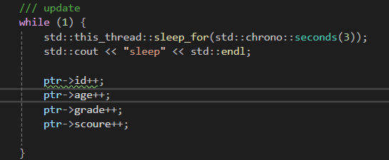

memory mapped file (window api )

사용 이유 : process간의 메모리 공유  
winapi : 
- CreateFileMapping
- OpenFileMapping
- MapViewOfFile 

---

https://learn.microsoft.com/ko-kr/windows/win32/memory/file-mapping

---

구현 : 

공유할 메모리 구조체 : include/Student
- id 
- age
- grade
- score

---
process :: main 
- struct크기 만큼의 mapping file을 생성 ( file name : shm_student)

- mapping file을 open ( file handle get)

- mapping file의 시작 주소 get 

- 3초 주기로 struct의 요소를 증가 
(id++, age++, grade++, score++ )
---

process :: clients 
- 동일한 file 이름으로 mapping file 생성 시도 

    - (이미 생성되어 있다면 , GetLastError()의 값이 ERROR_ALREADY_EXISTS 반환값은 기존 개체에 대한 핸들  반환)

- mapping file을 open ( file handle get)

- 3초 주기로 mapping object 요소를 확인 
---

main 

client 결과 확인

---

- 프로세스간 공유 목적으로 운영체제에서 사용하는 페이징 파일을 이용하는 목적이라면 실제 파일을 생성할 필요는 없다.
    - CreateFile은 불필요 ( 현재 예시에서 INVALID_HANDLE_VALUE을 사용하는 부분)
    - 

- 파일 객체 보호 특성 
     - 프로세스의 주소공간으로 매핑할 때, 시스템에서는 프로세스별 보호 특성을 지정해줘야 한다. 
        - main : readwrite (FILE_MAP_ALL_ACCESS )
        - clients : read ( FILE_MAP_READ )
            - clients에서 파일 객체 변경시에 dead 발생

- 파일 객체 해제 
    - UnmapViewOfFile로 프로세스 주소공간 매핑 해제 (release )
    - CloseHandle 파일 객체(handle 반환)

---

참고 

- https://learn.microsoft.com/en-us/dotnet/standard/io/memory-mapped-files
- https://learn.microsoft.com/ko-kr/windows/win32/api/winbase/nf-winbase-createfilemappinga
- https://luto.tistory.com/28

