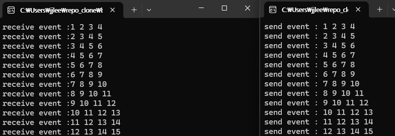

mailslot

-> file 기반의 단방향 통신 (IPC)

---
main ( receiver )

- mailslot file 생성 
- ReadFile을 통한 데이터 수신 
    - MAILSLOT_WAIT_FOREVER로 mailslot file을 만들었을 경우, 다른 프로세스가 write를 하기전까지 기다리게 됨. 

---
clients ( sender )
- mailslot name을 통해 mailslot file이 있는지 확인 ( CreateFile )
- WriteFile을 통한 write ( 데이터 송신 )

--- 

- sender에서 time 지연없이 계속 write를 해도, reader 쪽에서 메세지가 씹히거나 누락되지 않았음. 

- reader에서 데이터 처리를 위한 가정으로 sleep_thread를 주어도 sender에서 그 사이에 write한 내용이 누락되지 않았음. ( 순서 보장 )

(두 결과에서 data struct queue와 유사하게 동작함)

- mailslot의 reader 없이 clients 만 동작시켰을 경우에는 
OPEN_EXISTING 옵션을 통해 GetLastError() -> 2(0x2) 를 출력 

- 수신중에 reader를 종료시킬 경우, GetLastError() -> 2(0x2) 를 출력

---
결과 

--- 

참고 

- https://learn.microsoft.com/ko-kr/windows/win32/debug/system-error-codes--0-499-
- https://learn.microsoft.com/ko-kr/windows/win32/api/winbase/nf-winbase-createmailslota
- https://learn.microsoft.com/ko-kr/windows/win32/api/fileapi/nf-fileapi-readfile

- https://m.blog.naver.com/qkrghdud0/221067396709